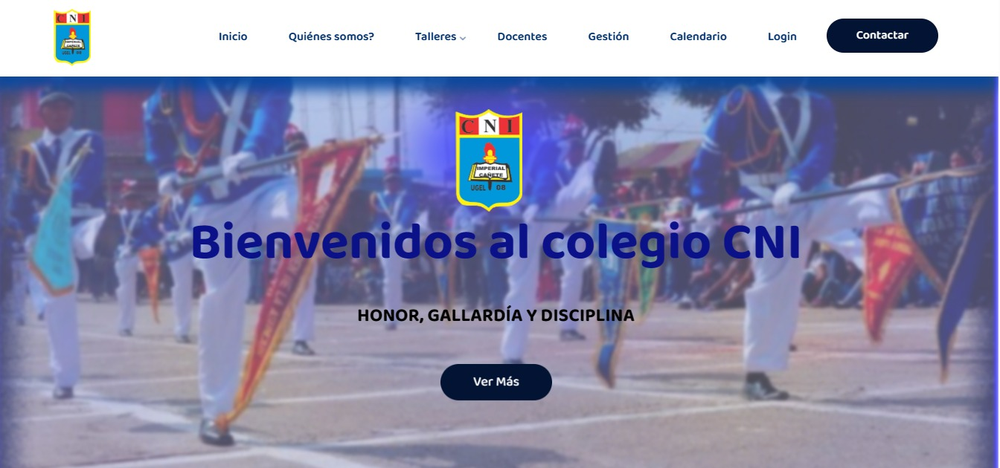
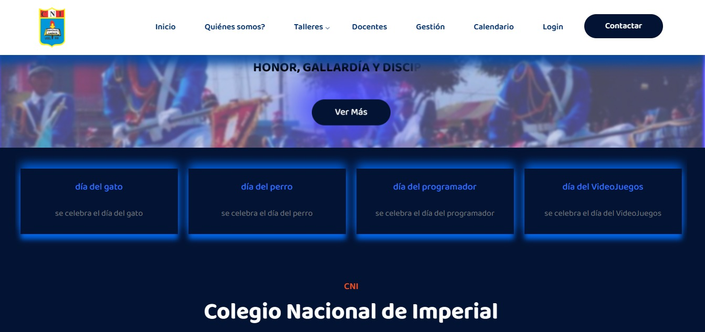
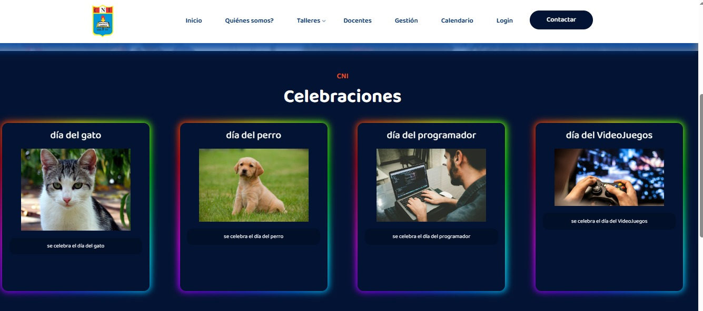
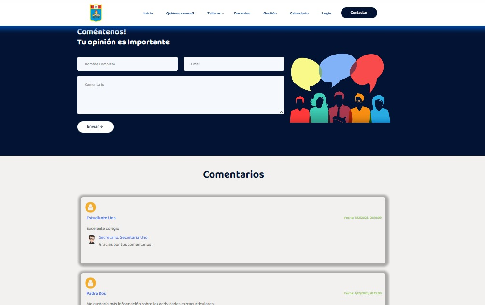
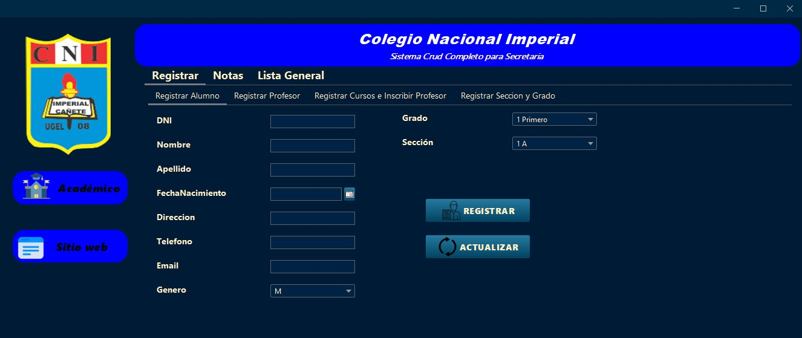
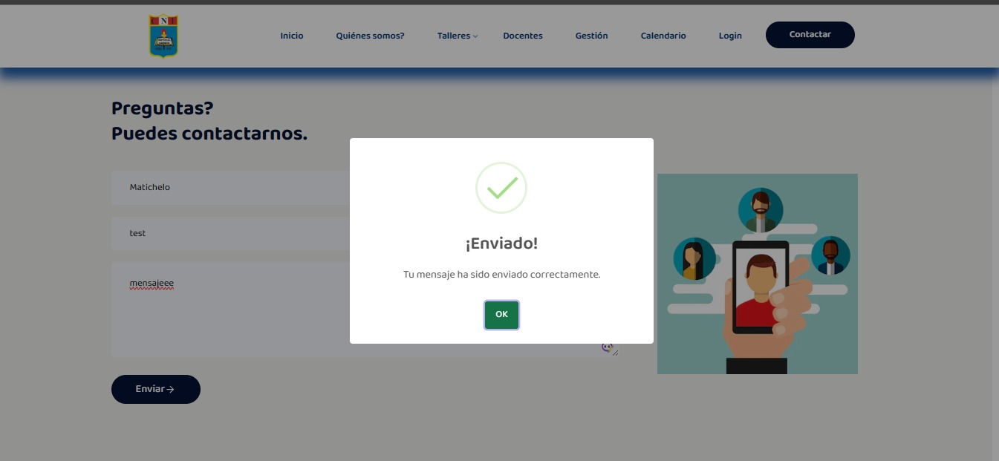
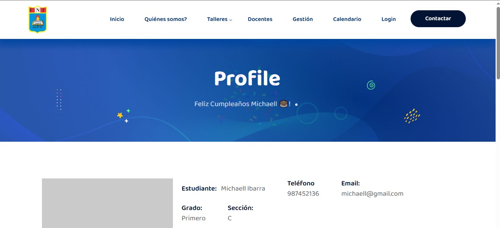

<h2 align="center"><u>Aplicativo Web Colegio CNI</u></h2>

<h4 align="center"> COLEGIO NACIONAL DE IMPERIAL (Michaell IBARRA | Yon ROJAS | Luis VALLE) </h4>

 
    
    
    

### [+] Description
Diseñado para el Colegio (CNI). Con un diseño intuitivo, ofrece acceso rápido a información vital, incluyendo talleres, perfiles de docentes, gestión académica, un calendario de eventos, y opciones de contacto. Los Alumnos autorizados pueden iniciar sesión de manera segura para aprovechar las funcionalidades personalizadas. Esta plataforma centralizada fortalece la conexión y mejora la experiencia educativa en CNI."

### [+] Installation
`npm install`

### [+] Usage
`npm start or npm run dev`

### [+] Features
 - Consultas sql de cantidad de Profesores, Estudiantes, Cursos
 - Banner de slider en todoas las páginas de fechas cuando se celebra algo
 - Conexión Formulario de Contacto con sql y validaciones
 - Poder comentar y el secretario responda
 - Página dedicada a fechas de celebraciones con imágenes
 - Login estudiante podrán ver su nota y su información y si es su cumpleaños aparecerá su un banner diciendo feliz cumpleaños
 - Implementacion de login de secretaria para dar respuestas al ausuario(crud dentro de la web).

### [+] Fotos

